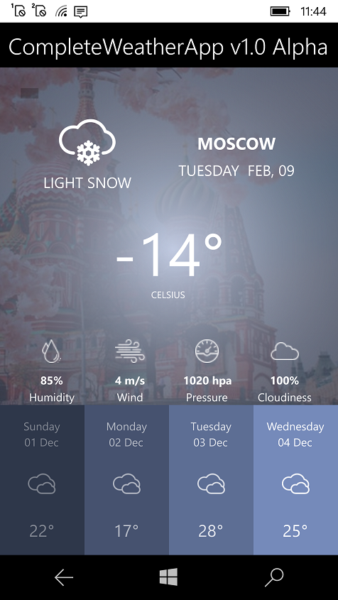

# Create a COMPLETE Mobile App In Xamarin Forms - The Weather App
Xamarin Forms lets you build native apps using a . NET cross-platform technologies that target the mobile, tablet, and desktop form factors on Android, iOS, Windows and more. 

This is the source code of the videos where you will learn how to build a COMPLETE cross-platform Android & iOS Weather Application using C# and Xamarin.Forms.

You can watch the videos here: https://www.youtube.com/playlist?list=PLsVdRN_cc4gveR7EOH5WZHQK1Jt75TOK7

# Quick Start (for your own experiments and code modifications)
- Clone the repo from GitHub
- Open in Visual Studio 2017/2019/2019 Preview
- To run this UWP sample app at WinPhone, choose ARM; to run this UWP sample app at Windows 10, choose x64. 

