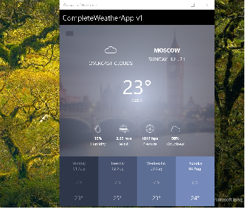
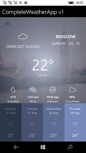

# CompleteWeatherApp v1.0.10

CompleteWeatherApp is part of my Project Gemini (meta-project about A and W worlds "connection"). 
If you want to be cross-platform developer, create your own COMPLETE Mobile App In Xamarin Forms ;)

## About
Create your COMPLETE Mobile App In Xamarin Forms - The Weather App with GPS tracking, geo-backgrounding, plus weather visualising via OpenWeatherMap! :-)

## Intro
Xamarin Forms lets you build native apps using a . NET cross-platform technologies that target the mobile, tablet, and desktop form factors on Android, iOS, Windows and more. 

This is the source code of the videos where you will learn how to build a COMPLETE cross-platform Android & iOS Weather Application using C# and Xamarin.Forms.

## Learn video
You can watch the videos here: https://www.youtube.com/playlist?list=PLsVdRN_cc4gveR7EOH5WZHQK1Jt75TOK7

## Screenshots

# Quick Start (for your own experiments and code modifications)
- Clone the repo from GitHub
- Open in Visual Studio 2022
- To run the UWP sample app at WinPhone, choose target ARM
- To run the UWP sample app at Windows 10, choose target  x64 
- To run the Android sample app at Droidphone, choose Android project as startup

## Contribute!
There's still a TON of things missing from this proof-of-concept (MVP) and areas of improvement 
which I just haven't had the time to get to yet:
- UI Improvements (Hamburger menu, etc.)
- Additional Language Packages (for English, Russian, etc.)
- Hamburger menu, Settings (GPS on/off; geo-backgrounding on/ off, etc.)
- System Geolocation (now this thing is damaged and not tuned!)

## .
With best wishes,

  [m][e] 2022

## License & Copyright

CompleteWeatherApp 1 is RnD project only. AS-IS. No support. Distributed under the MIT License.  
